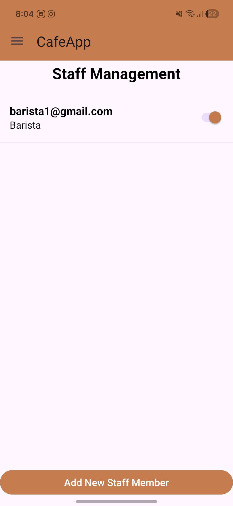
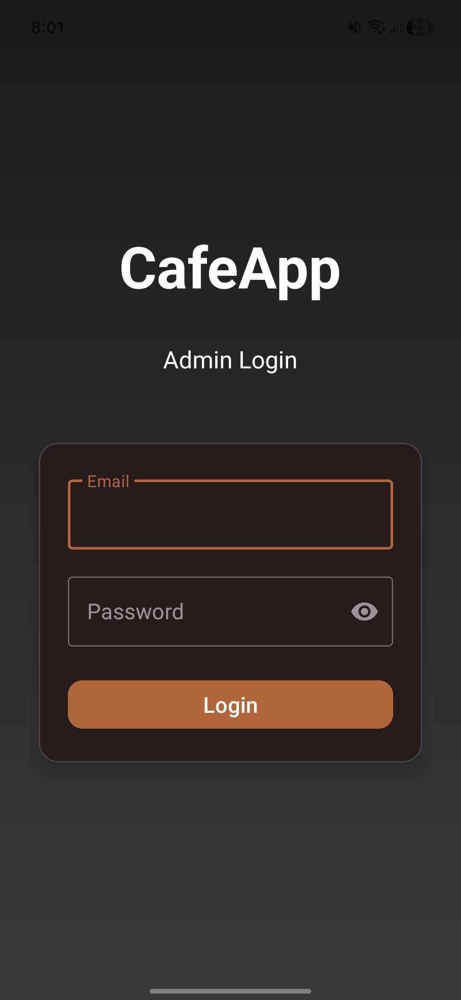
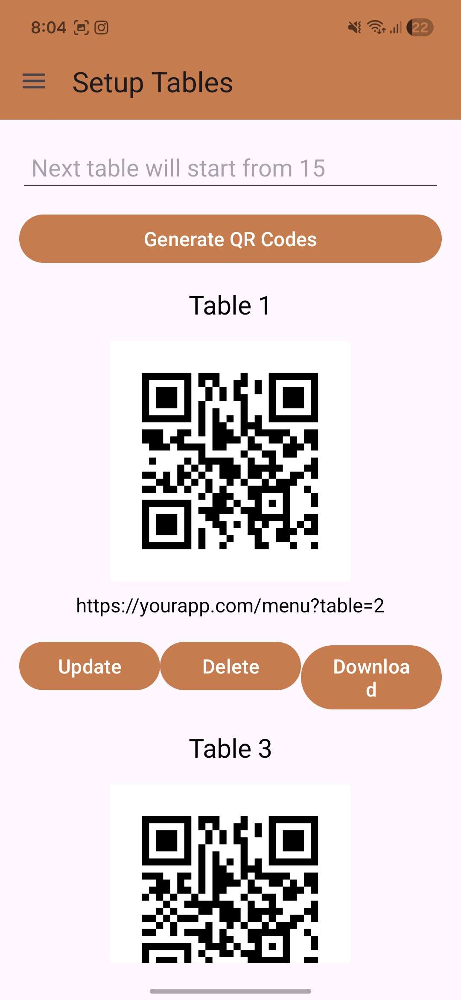
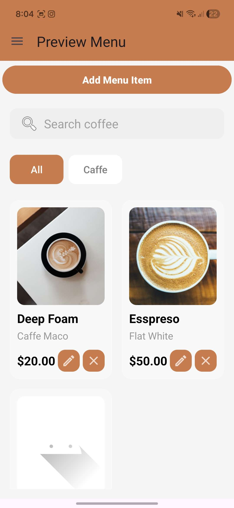
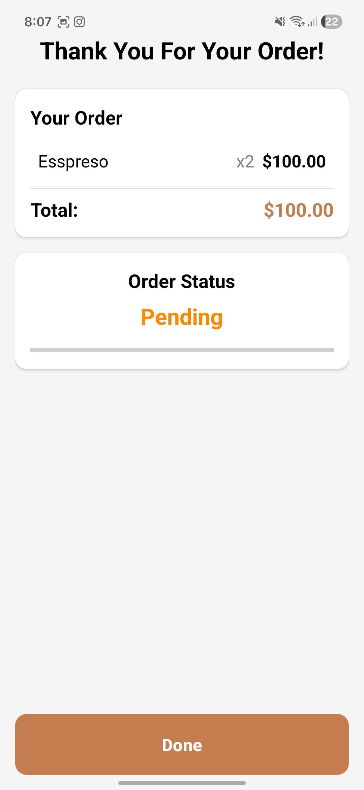
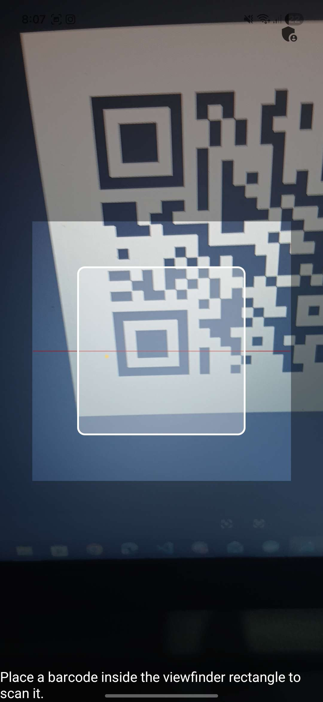
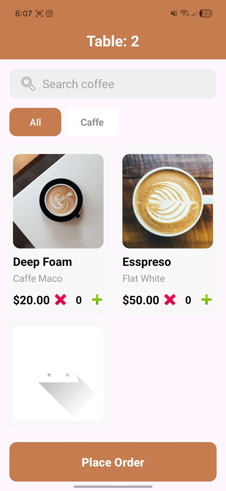
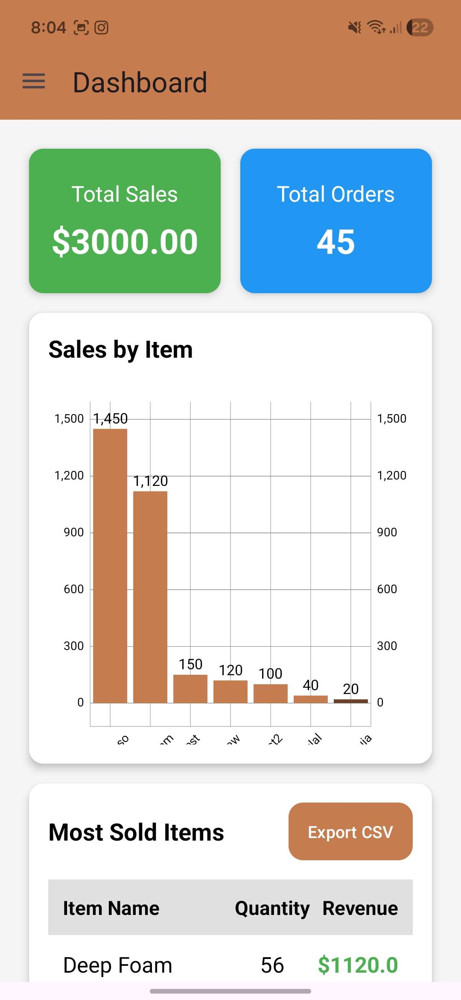

# CafeApp

A comprehensive Android application for cafe management and ordering. Built with modern Android development practices and Firebase backend integration.

## Overview

CafeApp is a feature-rich Android application that enables users to browse cafe menus, place orders, track deliveries, and manage their cafe experiences. The app integrates cutting-edge technologies to provide a seamless and intuitive user experience.

## 📱 Features

- **User Authentication:** Secure registration and login via Firebase Authentication
- **Menu Browsing:** Browse extensive cafe menus with detailed item descriptions
- **Order Management:** Place, track, and manage orders in real-time
- **Favorite Items:** Save and quickly access your favorite menu items
- **QR Code Scanning:** Quickly scan menu items and promotional codes using integrated barcode scanning
- **Image Gallery:** View high-quality product images with efficient caching
- **Analytics & Insights:** Track your ordering patterns and cafe visits
- **Real-time Updates:** Receive push notifications for order status and promotions
- **Data Visualization:** View cafe statistics and sales charts
- **Pull-to-Refresh:** Keep data updated with manual refresh capability

## 🛠 Technology Stack

### Development
- **Language:** Java 11
- **Framework:** Android SDK (API 24 - 36)
- **Build System:** Gradle with Kotlin DSL

### Backend & Services
- **Firebase Firestore:** Real-time database for menu items, orders, and user data
- **Firebase Storage:** Cloud storage for product images and documents
- **Firebase Analytics:** Track user behavior and app performance
- **Firebase Authentication:** Secure user registration and login

### Libraries & Dependencies
- **AndroidX Libraries:** AppCompat, Material Design, ConstraintLayout
- **QR Code Scanning:** ZXing (com.journeyapps:zxing-android-embedded:4.3.0)
- **Image Loading:** Glide (com.github.bumptech.glide:glide:4.16.0)
- **Data Visualization:** MPAndroidChart (com.github.PhilJay:MPAndroidChart:v3.1.0)
- **UI Components:** Material Design, SwipeRefreshLayout
- **Testing:** JUnit, Espresso

## 📋 Project Structure

```
CafeApp/
├── app/                              # Main application module
│   ├── src/
│   │   ├── main/
│   │   │   ├── java/                # Java source files
│   │   │   ├── res/                 # Resources (layouts, drawables, strings)
│   │   │   └── AndroidManifest.xml
│   │   ├── test/                    # Unit tests
│   │   └── androidTest/             # Instrumentation tests
│   ├── build.gradle.kts             # App module build configuration
│   └── proguard-rules.pro           # Obfuscation rules
├── gradle/                           # Gradle wrapper files
├── build.gradle.kts                 # Root build configuration
├── settings.gradle.kts              # Project settings
├── gradle.properties                # Gradle properties
├── gradlew & gradlew.bat           # Gradle wrapper scripts
└── README.md                        # This file
```

## 🚀 Getting Started

### Prerequisites
- Android Studio Arctic Fox (2021.1.1) or later
- Java Development Kit (JDK) 11 or higher
- Android SDK with API level 36 installed
- Gradle 8.0 or higher
- A Firebase account for backend services

### Installation Steps

1. **Clone the Repository**
   ```bash
   git clone https://github.com/kerkien/Cafeapp.git
   cd Cafeapp
   ```

2. **Open in Android Studio**
   - Launch Android Studio
   - Select **File > Open**
   - Navigate to the cloned `Cafeapp` directory
   - Click **OK** to open the project

3. **Sync Gradle Files**
   - Android Studio will prompt to sync Gradle files
   - Click **Sync Now** or use **File > Sync Project with Gradle Files**
   - Wait for the sync to complete

4. **Configure Firebase**
   - Create a new project at [Firebase Console](https://console.firebase.google.com/)
   - Add an Android app to your Firebase project:
     - Package name: `com.example.cafeapp`
     - App nickname: `CafeApp`
   - Download the `google-services.json` file
   - Place it in the `app/` directory of your project
   - Enable the following Firebase services:
     - **Authentication:** Email/Password
     - **Firestore Database:** Create a database in test mode initially
     - **Storage:** Create a storage bucket
     - **Analytics:** (Auto-enabled)

5. **Build the Project**
   ```bash
   ./gradlew build
   ```

6. **Run the Application**
   - Connect an Android device (API 24+) or launch an emulator
   - Click **Run > Run 'app'** in Android Studio
   - Or use the command line:
     ```bash
     ./gradlew installDebug
     ```

## 📝 Build Configuration

### SDK Versions
- **compileSdk:** 36
- **minSdk:** 24 (Android 7.0 and above)
- **targetSdk:** 36
- **Java Compatibility:** VERSION_11

### Application Information
- **Package Name:** com.example.cafeapp
- **Version Code:** 1
- **Version Name:** 1.0

### Build Types
- **Debug:** Development build with debugging enabled
- **Release:** Production build with ProGuard/R8 minification enabled

## 🔧 Development

### Building with Gradle Wrapper
Always use the Gradle wrapper to ensure consistent builds:

```bash
# On Linux/macOS
./gradlew build
./gradlew run

# On Windows
gradlew.bat build
gradlew.bat run
```

### Running Tests
```bash
# Unit tests
./gradlew test

# Instrumented tests
./gradlew connectedAndroidTest

# All tests
./gradlew check
```

### Debugging
- Use Android Studio's debugger: **Run > Debug 'app'**
- Check logcat for application logs: **View > Tool Windows > Logcat**

## 🤝 Contributing

We welcome contributions! To contribute to CafeApp:

1. Fork the repository
2. Create a feature branch: `git checkout -b feature/YourFeatureName`
3. Commit your changes: `git commit -m 'Add YourFeatureName'`
4. Push to the branch: `git push origin feature/YourFeatureName`
5. Open a Pull Request

### Coding Standards
- Follow Java naming conventions
- Use meaningful variable and method names
- Write clear comments for complex logic
- Ensure all tests pass before submitting a PR

## Screenshots

A few screenshots from the app (staff management, admin login, QR generation, menu preview...).

<table>
  <tr>
    <td align="center">
      <br/>
      <em>Staff Management</em>
    </td>
    <td align="center">
      <br/>
      <em>Admin Login</em>
    </td>
    <td align="center">
      <br/>
      <em>QR Codes</em>
    </td>
    <td align="center">
      <br/>
      <em>Menu Preview</em>
    </td>
  </tr>
  <tr>
    <td align="center">
      <br/>
      <em>Order Confirmation</em>
    </td>
    <td align="center">
      <br/>
      <em>QR Scanner</em>
    </td>
    <td align="center">
      <br/>
      <em>Table Menu</em>
    </td>
    <td align="center">
      <br/>
      <em>Dashborad</em>
    </td>
  </tr>
</table>

## 📚 Resources

- [Android Developer Documentation](https://developer.android.com/)
- [Firebase Documentation](https://firebase.google.com/docs)
- [Android Gradle Plugin Documentation](https://developer.android.com/studio/build)
- [Material Design Guidelines](https://material.io/design)

## 🐛 Troubleshooting

### Common Issues

**Gradle Sync Fails**
- Clear gradle cache: `./gradlew clean`
- Invalidate caches in Android Studio: **File > Invalidate Caches > Invalidate and Restart**

**Firebase Configuration Not Found**
- Ensure `google-services.json` is in the `app/` directory
- Rebuild the project: `./gradlew clean build`

**Emulator Issues**
- Use Android Studio's AVD Manager to create/update emulator images
- Ensure your system has sufficient disk space and RAM

**Build Errors**
- Check Java version: `java -version` (should be 11+)
- Update Android Studio to the latest version
- Review error messages in the Build console for specific issues

## 📊 Project Statistics

- **Repository:** [kerkien/Cafeapp](https://github.com/kerkien/Cafeapp)
- **Primary Language:** Java
- **Created:** November 3, 2025
- **Last Updated:** January 7, 2026
- **Status:** Active Development
- **Visibility:** Public

## 📞 Support & Contact

For issues, feature requests, or questions:
- Open an [Issue](https://github.com/kerkien/Cafeapp/issues) on GitHub
- Contact the project maintainer: [@kerkien](https://github.com/kerkien)

## 📄 License

This project is currently unlicensed. See the repository for licensing information.

---

**Built with ❤️ for cafe enthusiasts and developers**

Last Updated: April 23, 2026
